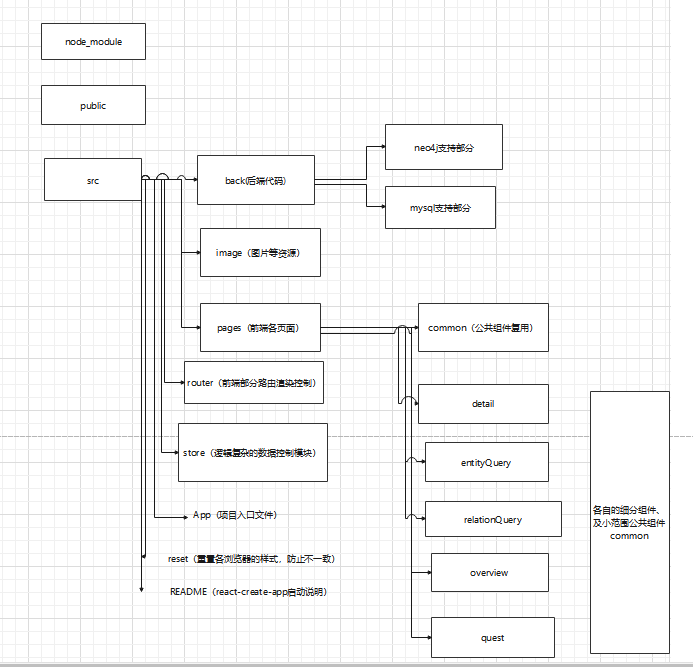

进展：上周修复了Chrome内核无法启动项目的问题（一方面是多中浏览器的支持是基本的需求，算是重要bug了，另一方面是如果不修复则无法使用react_dev_tool查看重新渲染情况）。

另外是花了两天时间去熟悉上学期写得项目代码，发现一些耦合严重的地方，可以提取common模块定制一些项目中的通用组件。

评估：

- 优化项目代码结构，1-2天
- 优化search功能，1天
- detail page开发，2-4天
- 基于HOOK重构的渲染优化， 1-2天
- 使用less语言进行前处理重构，优化样式查找效率， 1-2天
- 后端新支持的接入，待学习了解和评估，接入方面也需要一些时间
- 单元测试与前后端联调，在每项功能开发完之后，以及整体完成之后

下周从优化代码结构开始，逐步完成各项需求，虽然有一个预期时间，但是后端支持方面了解甚少，所以前面的需求会尽量加速完成，给后面提供一些提前量。

--------------

附带优化项目代码结构部分详设

【详细设计-代码结构优化】：

此前的目录结构中，以back、pages、store、router为结构，随着项目越来越大，其中pages模块越来越大，给维护和优化工作带来困难。

将修改目录结构，拟定提取出公共模块common，pages中分不同部分进行拆分，解耦合。

pages下每个部分再进行组件化开发，新产生的公共组件再提取到各自的common中，按照公共组件所在层级划分复用范围。

back中加入新模块，使用mysql进行后端请求支持，多种支持共同运行。（可行性暂未评估，因为这里需要学习一些新东西）

